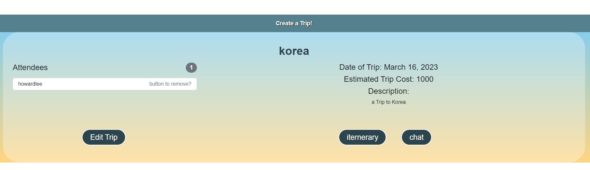
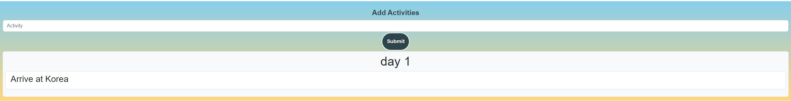
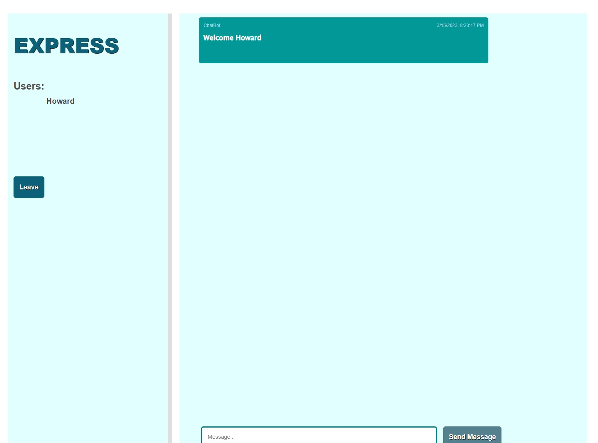

# Makin-Moves

## Description
Makin-Move is web application that help users plan their next trip. Users are able to register for an account and create a trip and plan out their trip. Users can add their friends to the trips that they made to allow him/her and their friends to add their desired or favorite activities on the trip. 
 
In this project a group of four members collaborated with each other to build this application. We learned how to build a front end using react and we used sequelize for our backend application.

## Usage
Start by creating account by clicking on the register button in the Navbar. When account is created, user will be automaticallyy logged into the application. After logging in, user will be able to see a `Create a Trip` button or they can click on the create a trip in the Navbar. Enter the required trip information and our application will create a trip for you. Depending on the duration of the trip the application will automatically build the amount of days for you. On each day card user can click on the `view day` and add activities into the day. If user want to delete the trip they can simply click on `Delete` to remove it. Each trip has a `chat` button that allow the user and their friend to join a chat room to discuss about their trip in a live chatroom.

## Screenshots

## Credits

- Thien Nguyen - Project Manager
- Howard Lee - Github Admin
- Jackie Lee - Javascript
- Nhan Duong - CSS
